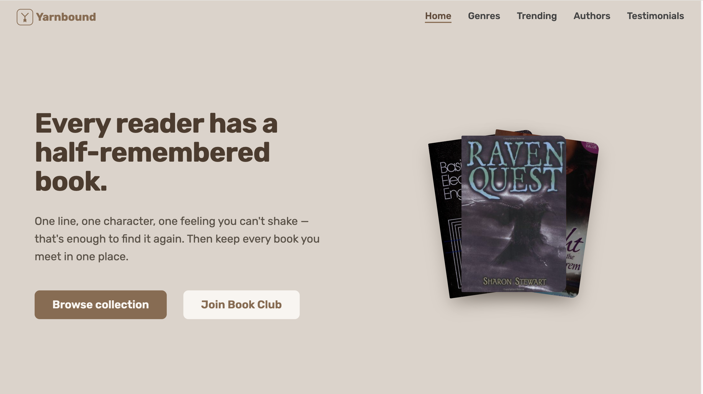

<div align="center">


# Yarnbound

**Find your next great read — even from a half-remembered line.**

The marketing site for Yarnbound, a book-discovery and reading-tracking app.
It tells the story, surfaces what readers are picking up right now, and sends
people into the app. Built with React and Vite, powered by live data from the
Open Library API.

[**Live site**](https://yarnbound.vercel.app) · [**The app**](https://yarnbound-marketplace.vercel.app)

</div>

---



## What it is

Yarnbound helps readers find their next book — by title, author, genre, or even
a line they can only half-remember — and keep track of the ones they love. This
repository is the **marketing site**: a fast, single-page pitch whose job is to
turn a visitor into an app user.

Two properties make up the product:

| Property           | Repo                    | Role                                                                         |
| ------------------ | ----------------------- | ---------------------------------------------------------------------------- |
| **Marketing site** | `yarnbound` (this repo) | The pitch. Fast, mostly static, live trending accents, funnels into the app. |
| **App**            | `yarnbound-marketplace` | The product. Search, genres, author pages, lists, reading tracking.          |

## Why it's worth a look

- **Live, honest data.** Trending books and featured authors are fetched from
  the Open Library API at load time — never hardcoded, never faked. What you see
  is what people are actually reading. No invented ratings, no stock covers.
- **Every section is a door.** Genres, trending books, and authors each link
  straight into the app. Nothing on the page is a dead end.
- **Accessible by construction** — semantic landmarks, full keyboard support with
  visible focus states, a scrollspy that announces the active section, and
  `prefers-reduced-motion` honored throughout.
- **Built for performance** — reserved space for loading content (no layout
  shift), lazy-loaded images, and shared cached requests so scrolling and
  tab-switching never refetch. Run Lighthouse against the live site to see for
  yourself.
- **One design language** — a single warm palette defined as CSS custom
  properties (a 50–900 brown scale) drives every color on the page.

## Tech stack

| Area       | Choice                  | Why                                                               |
| ---------- | ----------------------- | ----------------------------------------------------------------- |
| Framework  | React 19                | Components and hooks; the same ecosystem as the app.              |
| Build tool | Vite                    | Instant dev server and fast, minified production builds.          |
| Language   | JavaScript              | Matches the app; kept deliberately dependency-light.              |
| Styling    | CSS Modules             | Scoped styles, zero runtime; design tokens in one global `:root`. |
| Data       | Open Library API        | A free, open catalogue of millions of books.                      |
| Data layer | TanStack Query          | Caching, request de-duplication, and loading/error state.         |
| Icons      | react-icons (Heroicons) | One consistent icon family.                                       |
| Hosting    | Vercel                  | Zero-config deploys; the site is installable via a web manifest.  |

## Architecture

The page is a set of independent, self-contained sections. Data fetching lives
behind a small layered service API, so components stay presentational and easy
to reason about.

```
yarnbound/
├── public/                         # served as-is: favicons, og-image, manifest, robots, sitemap
├── screenshots/                    # README images (not shipped with the app)
└── src/
    ├── assets/
    │   └── book-cover.png          # placeholder cover for books with no image
    ├── components/                 # Header, Navbar, Hero, section components, shared UI
    │   ├── AuthorPhoto.jsx             #  with an initials fallback (OL serves 1x1 blanks)
    │   ├── BookCover.jsx               #  with a placeholder fallback for missing covers
    │   ├── Header.jsx / Navbar.jsx / NavList.jsx / Logo.jsx / Hero.jsx
    │   ├── SectionGenres.jsx           # static genre grid -> links into the app
    │   ├── SectionTrendingBooks.jsx    # live trending books with timeframe tabs
    │   ├── SectionFeaturedAuthors.jsx  # live authors derived from trending books
    │   ├── SectionTestimonials.jsx     # reader testimonials
    │   ├── SectionCta.jsx / SectionNewsletter.jsx / Footer.jsx
    │   └── SectionHeader.jsx           # shared eyebrow + heading + description
    ├── data/
    │   ├── bookGenres.js               # the eight featured genres (static)
    │   └── testimonials.js             # reader testimonials
    ├── hooks/
    │   ├── useActiveSection.js         # scrollspy (IntersectionObserver) for nav highlighting
    │   ├── useFeaturedAuthors.js
    │   ├── useReveal.js                # scroll-reveal entrance animation
    │   └── useTrendingBooks.js         # windows results per surface (hero vs. grid)
    ├── services/
    │   ├── apiConfig.js                # base URLs, result limits, request timeout
    │   ├── apiEndpointBuilders.js      # constructs Open Library query URLs
    │   ├── apiBooks.js                 # fetch + format trending books
    │   └── apiAuthors.js               # derive + fetch featured authors
    ├── utils/
    │   └── helpers.js                  # formatters, slug/URL builders, name initials
    ├── App.jsx
    ├── index.css                       # global tokens (:root), utilities, base styles
    └── main.jsx
```

**Four decisions shaped this codebase:**

- **Volatility, not capability, decides static vs. dynamic.** Genres are the
  site's _map_ — they rarely change, so they are static and crawlable. Trending
  books and authors are the site's _pulse_ — so they are fetched live.
- **Components are presentational; hooks own data.** A section renders what it is
  handed. How many books each surface shows is decided in the hook, so the hero
  and the trending grid share a single cached request instead of fetching twice.
- **Authors are derived, not searched.** Featured authors come from the author
  keys attached to trending books — deduplicated, then fetched in one batched
  request. One honest source for "who is trending now."
- **Fallbacks live in one place.** `BookCover` and `AuthorPhoto` each own their
  own placeholder logic, so no caller ever has to handle a missing image.

## Accessibility

- Semantic landmarks (`<header>`, `<main>`, `<nav>`, `<footer>`) and a labelled
  primary navigation.
- Full keyboard support with visible, on-brand focus rings on every interactive
  element.
- A scrollspy that sets `aria-current` on the active nav link — the audio
  equivalent of the visual underline.
- `prefers-reduced-motion` disables entrance and hover motion.
- Decorative images use empty `alt`; initials-fallback avatars are hidden from
  assistive tech.
- Text colors meet WCAG AA contrast.

## Performance

- **No layout shift** — skeletons reserve the exact space of loading content, so
  nothing jumps as data arrives.
- **Intrinsic responsive grids** — `auto-fit` with `minmax(min(100%, Nrem), 1fr)`
  adapts from one to many columns with almost no media queries and no overflow.
- **Lazy-loaded images** decoded off the main thread.
- **Shared, cached requests** — the hero and trending grid read from one cache
  entry, so scrolling and tab-switching never refetch.

## Getting started

**Prerequisites:** Node 22 or newer, and npm.

```bash
git clone https://github.com/chrisjay358/yarnbound.git
cd yarnbound
npm install
npm run dev          # http://localhost:5173
```

**Scripts**

| Command           | Does                                |
| ----------------- | ----------------------------------- |
| `npm run dev`     | Start the Vite dev server.          |
| `npm run build`   | Production build to `/dist`.        |
| `npm run preview` | Serve the production build locally. |
| `npm run lint`    | Run ESLint.                         |

## Credits

Book, author, and cover data from
[Open Library](https://openlibrary.org), a project of the Internet Archive.

---

<div align="center">

Designed and built for book lovers.

</div>
